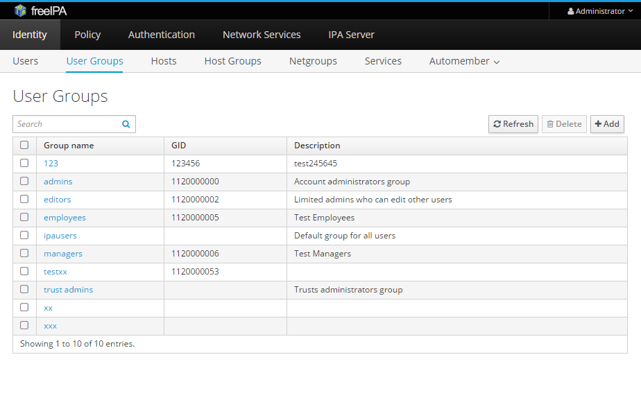

# Testovací případy

Výchozí stránkou pro všechny testovací příkazy je stránka "User Groups" ve webovém rozhraní.

Obr. 1 - výchozí stránka pro testování
 

## 1.) Přidání skupiny
### a.) Přidej skupinu
  * ID: 1
  * Název: Přidání nové skupiny
  * Účel: Přidání skupiny bez dalších akcí
  * Podmínky: Musí být přihlášen uživatel s příslušnými právy
  * Kroky:
    1. Kliknutí na tlačítko "Add"
    2. Vyplnění požadovaných dat
	    * např. "TESTGROUP" do 255 znaků
	    * pozn. may only include letters, numbers, _, -, . and $
	3. Kliknutí na tlačítko "Add"
  * Očekávaný výsledek:
	1. Proběhne vytvoření nové skupiny
	2. Návrat na stránku "User Groups"
	3. Zobrazení nové skupiny ve sloupci "Group name"
  * Provedení testu: PASS

### b.) Přidej skupinu a přidej další
  * ID: 2
  * Název: Přidání nové skupiny a poté další
  * Účel: Přidání skupiny a následné otevření okna pro přidání další
  * Podmínky: Musí být přihlášen uživatel s příslušnými právy
  * Kroky:
    1. Kliknutí na tlačítko "Add"
    2. Vyplnění požadovaných dat
	    * např. "TESTGROUP2"
	3. Kliknutí na tlačítko "Add and Add another"
  * Očekávaný výsledek:
	1. Proběhne vytvoření nové skupiny
	2. Zobrazení nové skupiny ve sloupci "Group name" 
	3. Znovuotevření okna "Add User Group"
  * Provedení testu: PASS

### c) Přidej skupinu a edituj ji
  * ID: 3
  * Název: Přidání nové skupiny a editace
  * Účel: Přidání skupiny a následné otevření okna pro editaci
  * Podmínky: Musí být přihlášen uživatel s příslušnými právy
  * Kroky:
    1. Kliknutí na tlačítko "Add"
    2. Vyplnění požadovaných dat
	  * např. "TESTGROUP3"
	3. Kliknutí na tlačítko "Add and Edit"
  * Očekávaný výsledek:
	1. Proběhne vytvoření nové skupiny
	2. Přesměrování na kartu nastavení nově vytvořené skupiny
  * Provedení testu: PASS

## 2.) Odstraň skupinu

### a) Odstranění v seznamu skupin
  * ID: 4
  * Název: Odstranění ze seznamu skupin
  * Účel: Odstranění skupiny nebo většího množství skupin
  * Podmínky: Musí být přihlášen uživatel s příslušnými právy a vytvořeny skupiny, které mají být odstraněny
  * Kroky:
    1. Zaškrtneme požadovanou skupinu, kterou chceme odstranit
      * zaškrkávací políčko v prvním sloupci
      * možno zaškrnout více skupin
	2. Kliknutí na tlačítko "Delete"
	3. Potvrzení odstranění v okně "Remove User Groups" tlačítek "Delete"
  * Očekávaný výsledek:
	1. Odstranění vybraných skupin
  * Provedení testu: PASS

### b) Odstranění v nastavení skupiny
  * ID: 5
  * Název: Odstranění v nastavení skupiny
  * Účel: Odstranění skupiny nebo většího množství skupin
  * Podmínky: Musí být přihlášen uživatel s příslušnými právy a vytvořena skupina, které mají být odstraněny
  * Kroky:
    1. Klikneme na požadovanou skupinu
	2. Přesměrování na stránku dané skupiny
	3. Klikneme na tlačítko "Settings"
	4. Klikneme na tlačítko "Actions"
	5. Vybereme položku "Delete"
	6. Potvrzení smazání skupiny v okně "Confirmation" tlačítkem "OK"
  * Očekávaný výsledek:
	1. Odstranění vybrané skupiny
	2. Navrácení na stránku "User Groups"
  * Provedení testu: PASS

## 3.) Přidej uživatele do skupiny
  * ID: 6
  * Název: Přídání uživatele do skupiny
  * Účel: Přidání uživatele do skupiny
  * Podmínky: Musí být přihlášen uživatel s příslušnými právy a vytvořena skupina, musí být vytvořen uživatel, který má být přidána
  * Kroky:
    1. Klikneme na požadovanou skupinu
	2. Přesměrování na stránku dané skupiny
	3. Klikneme na tlačítko "Add"
	4. Zaškrtneme požadované uživatele
	  * můžeme vybrat i více uživatelů  
	5. Klikneme na tlačítko ">"
	6. Klikneme na tlačítko "Add"
  * Očekávaný výsledek:
	1. Přidání uživatelů do skupiny
	2. Zobrazení jednotlivých uživatelů na kartě skupiny
  * Provedení testu: PASS

## 4.) Odeber uživatele ze skupiny
  * ID: 7
  * Název: Odebrání uživatele ze skupiny
  * Účel: Odebrání uživatele ze skupiny
  * Podmínky: Musí být přihlášen uživatel s příslušnými právy a vytvořena skupina, která musí obsahovat uživatele, kteří mají být odebráni
  * Kroky:
    1. Klikneme na požadovanou skupinu
	2. Přesměrování na stránku dané skupiny
	3. Zaškrtneme požadované uživatele
	  * můžeme vybrat i více uživatelů  
	4. Klikneme na tlačítko "Delete"
	5. Klikneme na tlačítko "Delete" v okně "Remove User from User Group %nazev_skupiny"
  * Očekávaný výsledek:
	1. Odstranění uživatelů ze skupiny
	2. Zobrazení jednotlivých uživatelů na kartě skupiny
  * Provedení testu: PASS

## 5.) Přidej skupinu do skupiny
  * ID: 8
  * Název: Přídání skupiny do skupiny
  * Účel: Přidání skupiny do skupiny
  * Podmínky: Musí být přihlášen uživatel s příslušnými právy a vytvořena skupina, musí být vytvořena skupina, která má být přidána
  * Kroky:
    1. Klikneme na požadovanou skupinu
	2. Přesměrování na stránku dané skupiny
	3. Klikneme na tlačítko "User Groups"
	4. Klikneme na tlačítko "Add"
	5. Zaškrtneme požadované skupiny
	  * můžeme vybrat i více skupin  
	6. Klikneme na tlačítko ">"
	7. Klikneme na tlačítko "Add"
  * Očekávaný výsledek:
	1. Přidání skupin do skupiny
	2. Zobrazení jednotlivých skupin na kartě skupiny
  * Provedení testu: PASS

## 6.) Odeber skupinu ze skupiny
  * ID: 9
  * Název: Odebrání skupin ze skupiny
  * Účel: Odebrání skupin ze skupiny
  * Podmínky: Musí být přihlášen uživatel s příslušnými právy a vytvořena skupina, která obsahuje skupiny, které mají být odebrány
  * Kroky:
    1. Klikneme na požadovanou skupinu
	2. Přesměrování na stránku dané skupiny
	3. Klikneme na tlačítko "User Groups"
	4. Zaškrtneme požadované skupiny
	  * můžeme vybrat i více skupin  
	4. Klikneme na tlačítko "Delete"
	5. Klikneme na tlačítko "Delete" v okně "Remove User Groups from User Group %nazev_skupiny"
  * Očekávaný výsledek:
	1. Odstranění skupin ze skupiny
	2. Zobrazení jednotlivých skupin na kartě skupiny
  * Provedení testu: PASS

## 7.) Změň nastavení skupiny

### a) Změna, která bude uložena
  * ID: 10
  * Název: Změna nastavení skupiny
  * Účel: Změna nastavení skupiny
  * Podmínky: Musí být přihlášen uživatel s příslušnými právy a vytvořena skupina, která má být editována
  * Kroky:
    1. Klikneme na požadovanou skupinu
	2. Přesměrování na stránku dané skupiny
	3. Klikneme na tlačítko "Settings"
	4. Pozměníme požadavaná data
	  * např. GID nebo popis
	5. Klikneme na tlačítko "Save"
  * Očekávaný výsledek:
	1. Změna nastavení skupiny
  * Provedení testu: PASS

### b) Změna, která bude vrácena pomocí "Revert"
  * ID: 10
  * Název: Změna nastavení skupiny
  * Účel: Změna nastavení skupiny a následné vrácení změněných hodnot pomocí "Revert"
  * Podmínky: Musí být přihlášen uživatel s příslušnými právy a vytvořena skupina, která má být editována
  * Kroky:
    1. Klikneme na požadovanou skupinu
	2. Přesměrování na stránku dané skupiny
	3. Klikneme na tlačítko "Settings"
	4. Pozměníme požadavaná data
	  * např. GID a popis
	5. Klikneme na tlačítko "Revert"
  * Očekávaný výsledek:
	1. Původní hodnoty před úpravou v celém nastavení
  * Provedení testu: PASS

### b) Změna, která bude vrácena pomocí "Undo"
  * ID: 10
  * Název: Změna nastavení skupiny
  * Účel: Změna nastavení skupiny a následné vrácení změněných hodnot pomocí "Undo"
  * Podmínky: Musí být přihlášen uživatel s příslušnými právy a vytvořena skupina, která má být editována
  * Kroky:
    1. Klikneme na požadovanou skupinu
	2. Přesměrování na stránku dané skupiny
	3. Klikneme na tlačítko "Settings"
	4. Pozměníme požadavaná data
	  * např. GID nebo popis
	5. Klikneme na tlačítko "Undo" u editované položky
  * Očekávaný výsledek:
	1. Původní hodnoty před úpravou u konkrétní položky
  * Provedení testu: PASS

## 8.) Vyhledej skupinu
  * ID: 13
  * Název: Vyhledání skupiny
  * Účel: Vyhledání požadované skupiny
  * Podmínky: Musí být přihlášen uživatel s příslušnými právy a vytvořena skupina, která má být vyhledána
  * Kroky:
    1. Do okna "Search" zadáme řetězec vyskytující se v názvu nebo popisu skupiny
	    * např. "tor" pro skupiny "editors", "admins" a "trust admins"
	    * pozn. vyhledávání probíhá i v popisu skupiny a vynechává bílé znaky
	2. Kliknutí na lupu v okně "Search"
  * Očekávaný výsledek:
	1. Zobrazení skupin obsahující podřetezec v názvu nebo popisu skupiny
  * Provedení testu: PASS

## 9.) Přidání skupiny - fail - nevalidní znaky
  * ID: 14
  * Název: Přidání nové skupiny - nevalidní znaky
  * Účel: Zkouška přidání skupiny s nevalidními znaky
  * Podmínky: Musí být přihlášen uživatel s příslušnými právy
  * Kroky:
    1. Kliknutí na tlačítko "Add"
    2. Vyplnění požadovaných dat
	    * znaky mimo písmena, číslice, _, -, . a $
	    * délka řetězce přes 255 znaků
	3. Kliknutí na tlačítko "Add"
  * Očekávaný výsledek:
	1. Zobrazení chybové hlášky "may only include letters, numbers, _, -, . and $"
  * Provedení testu: FAIL
 

## 10.) Přidání skupiny - fail - stejný název skupiny
  * ID: 15
  * Název: Přidání nové skupiny - duplikace
  * Účel: Zkouška přidání skupiny, která má stejný název jako jiná již vytvořená
  * Podmínky: Musí být přihlášen uživatel s příslušnými právy, musí být vytvořena skupina se stejným názvem
  * Kroky:
    1. Kliknutí na tlačítko "Add"
    2. Vyplnění požadovaných dat
	    * např. "TESTGROUP"
	3. Kliknutí na tlačítko "Add and Add another"
	4. Vyplnění požadovaných dat
	    * např. "TESTGROUP" - stejné jako v bodu 2
	5. Kliknutí na tlačítko "Add"
  * Očekávaný výsledek:
	1. Zobrazení chybové hlášky "Internal Server Error"
  * Provedení testu: FAIL

## 11.) Přidání skupiny - fail - stejný GID
  * ID: 16
  * Název: Přidání nové skupiny - duplikace GID
  * Účel: Zkouška přidání skupiny, která má stejný GID jako jiná již vytvořená
  * Podmínky: Musí být přihlášen uživatel s příslušnými právy, musí být vytvořena skupina se stejným GID
  * Kroky:
    1. Kliknutí na tlačítko "Add"
    2. Vyplnění požadovaných dat
	    * např. "TESTGROUP1" a GID "123"
	3. Kliknutí na tlačítko "Add and Add another"
	4. Vyplnění požadovaných dat
	    * např. "TESTGROUP2" a GID "123"
	5. Kliknutí na tlačítko "Add"
  * Očekávaný výsledek:
	1. Zobrazení chybové hlášky "Internal Server Error"
  * Provedení testu: FAIL

## 12.) Přidání skupiny - fail - nevyplněn název skupiny
  * ID: 17
  * Název: Přidání nové skupiny - nevyplněn název skupiny
  * Účel: Zkouška přidání skupiny bez názvu skupiny
  * Podmínky: Musí být přihlášen uživatel s příslušnými právy
  * Kroky:
    1. Kliknutí na tlačítko "Add"
    2. Vyplnění požadovaných dat, kromě "Group name"
	3. Kliknutí na tlačítko "Add"
  * Očekávaný výsledek:
	1. Zobrazení chybové hlášky "Required field"
  * Provedení testu: FAIL