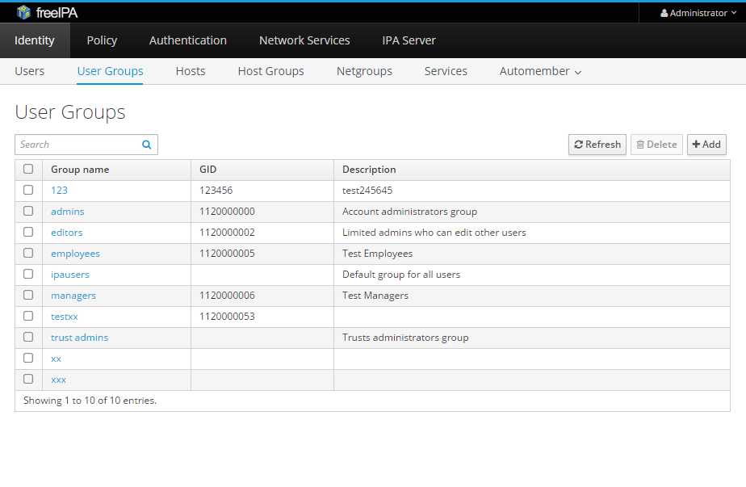

# Testovací plán

## Identifikátor:

ITS-XPAVLI78

## Úvod:

Cílem tohoto testování je ověřit funkčnost uživatelského webového rozhraní projektu s otevřeným zdrojovým kódem FreeIPA v4.3.1.

## Reference:

  * Dokumentace k projektu FreeIPA
    * https://www.freeipa.org/page/Documentation

## Testované položky:
  
  * Webové rozhraní projetku FreeIPA v4.3.1.

## Funkce, které jsou testovány:

  * Přidání skupiny
    * Přidej skupinu
    * Přidej skupinu a přidej další
    * Přidej skupinu a edituj ji
  * Odstraň skupinu
    * Odstranění v seznamu skupin
    * Odstranění v nastavení skupiny 
  * Přidej uživatele do skupiny
  * Odeber uživatele ze skupiny
  * Přidej skupinu do skupiny
  * Odeber skupinu ze skupiny
  * Změn nastavení skupiny
    * Změna, která bude uložena
    * Změna, která bude vrácena pomocí "Revert"
    * Změna, která bude vrácena pomocí "Undo"
  * Vyhledej skupinu
  * Přidání skupiny - fail - nevalidní znaky
  * Přidání skupiny - fail - stejný název skupiny
  * Přidání skupiny - fail - stejné GID
  * Přidání skupiny - fail - nevyplněn název skupiny

## Přístup:

  * Integritní testování
  * Testování pomocí programu Selenium

## Kritéria pro splnění:

  * Splnění požadované funkcionality
  * Zvládnutí zpracování krajních hodnot
  * Vrácení chyby v případě, že se jedná o chybu

## Kritéria pro pozastavení testování a požadavky na obnovení:

### Kritéria pro pozastavení:

  * V případě, že selže test na základní funcionalitu, bude daný funkce pozastavena.

### Kritéria pro obnovení:

  * Fuknce bude obnovena ve chvíli, kdy bude vývojářem oznámeno opravení chyby.
  * Je nutné dodání nového kódu a detailní popis opravení chyby.

## Přílohy:

  * Seznam příloh:
    * [Testovací plán](testplan.md)
    * [Testovací případy](testcases.md)
	* Testovaná stránka
    
    * Vlastní stránka
    

## Potřebné prostředí:

  * Webové rozhraní projektu FreeIPA
  * Selenium
  * Počítač s přístupem k internetu

## Odhad:

  * Odhadovaná časová náročnost je v desítkách hodin. Zahrnující nastudování dokumentace a zjištění potřebných informací.

## Časový plán:

  * 11.4.2016 - zpracování testovacího plánu
  * 1.5.2016 - zpracování testovací sady

## Personální a vzdělávací potřeby:

  * Je nutné proškolení testera pro práci s nástrojem Selenium.

## Povinnosti:

  * Vedoucí testování - Ing. Aleš Smrčka, Ph.D.
    * Kontrola testovacího plánu
    * Kontrola skriptů
  * Test manager/Test analytik/Tester - Jan Pavlica 
    * Vytvoření testovacího plánu
    * Vytvoření testovací sady
    * Testování

## Rizika:

  * Možných vznik rizik v důsledku nezkušenosti testera.

## Schválení:

*  Jan Pavlica - Test manager	
	*  11.4.2016 v Brně